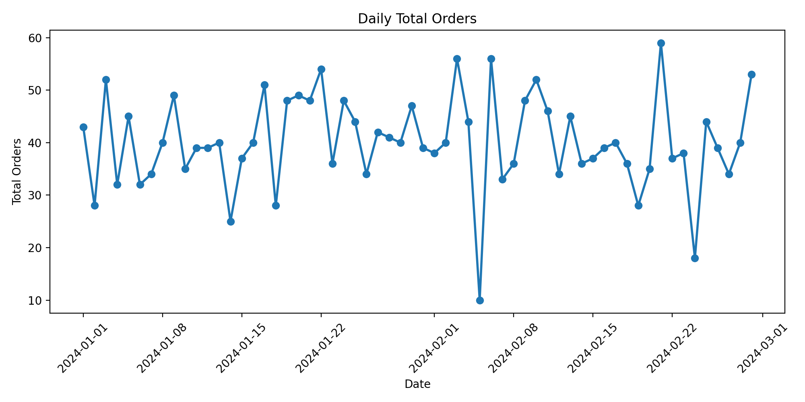

## Pipeline Flow

### 1. Raw Data Generation

Synthetic raw data is generated for:
- factory orders
- factory deliveries

The raw data intentionally includes:
- duplicate records
- missing supplier IDs
- invalid quantities
- inconsistent status values
- orphan deliveries
- one low-volume day for anomaly detection

### 2. Data Cleaning

The pipeline performs:
- duplicate removal
- date parsing
- status standardization
- invalid quantity filtering
- joining deliveries back to orders

### 3. KPI Output

The pipeline produces a daily KPI table with:
- total orders
- total deliveries
- on-time delivery rate
- average delivery delay days

### 4. Monitoring

The project also generates:
- a data quality report
- an alert log for large day-over-day order volume drops

## Output Files

### Clean Table
`data/clean/factory_orders_clean.csv`

### KPI Table
`data/output/daily_factory_kpi.csv`

### Data Quality Report
`data/output/dq_report.csv`

### Alert Log
`data/output/alert_log.csv`

## KPI Visualization

## Example Data Quality Checks

- duplicate order ID check
- missing supplier ID check
- invalid order quantity check
- orphan delivery check

## Example Alert Rule

An alert is triggered when daily total orders drop by more than 40% compared with the previous day.

## How to Run

### Step 1: Generate raw data
Run `generate_fake_data.py`

### Step 2: Build clean table and KPI table
Run `pipeline.py`

### Step 3: Run data quality checks and alert logic
Run `checks.py`

## Why I Built This Project

I created this project as a public prototype inspired by factory data automation work. The goal was to turn a more complex internal workflow into a simplified, interview-friendly project that still demonstrates ETL design, KPI reporting, data quality checks, and monitoring.

## Future Improvements

- Add incremental processing with a watermark file
- Add a dashboard layer
- Add unit tests
- Add more factory domains such as inventory and returns
- Deploy the pipeline in a cloud environment
